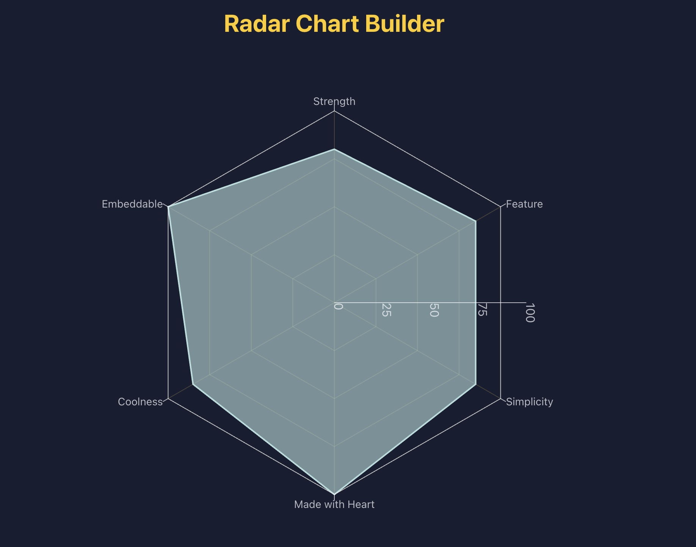

<h1 align="center">
  <a href="https://radar-chart-builder.vercel.app/" title="Radar Chart Builder">Radar Chart Builder</a>
</h1>

<p align="center">
  <a href="https://nextjs.org/" title="Next.js">
    
  </a>
  <a href="https://tailwindcss.com/" title="Tailwind CSS">
    
  </a>
  <a href="https://vercel.com/" title="Vercel">
  </a>
    
</p>

<p align="center">
  
</p>

## Overview

This project delivers a web-based builder for highly customizable, embeddable
radar chart widgets. Built with Next.js, it lets you design chart visuals,
refine labels and data, and then drop the generated widget anywhere HTML is
supported—including tools like Notion, blogs, or documentation portals.

## Live Demo

https://radar-chart-builder.vercel.app/

## Features

- Highly customizable radar charts with intuitive controls
- Instant visual feedback while adjusting labels, values, and styles
- Exportable widgets that embed cleanly into docs, dashboards, and note apps
- Powered by [Recharts](https://github.com/recharts/recharts) for the chart
  rendering engine

## Quick Start

```bash
npm install
npm run dev
# visit http://localhost:3000 (landing) or /chart for the builder
```

## Contributing

See [CONTRIBUTING.md](.github/CONTRIBUTING.md) for detailed setup steps, coding
standards, and pull request expectations.
